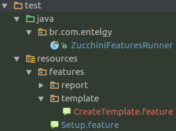

# Zucchini


Zucchini (zo͞oˈkēnē), a.k.a Abobrinha, is a testing tool based on [Cucumber](https://cucumber.io/) with many predefined steps.

## Usage

```xml
<dependency>
    <groupId>br.com.entelgy</groupId>
    <artifactId>zucchini</artifactId>
    <version>1.1.1</version>
    <scope>test</scope>
</dependency>

```

## Setup

```java
@RunWith(Cucumber.class)
@CucumberOptions(
	format = {
		"pretty",
		"html:target/cucumber-reports/html"
	},
	monochrome = false,
	features = { "src/test/resources/features/" },
	glue = { "your.awesome.package" },
	tags = { "@setup,@it" }
)
public class ZucchiniFeaturesRunner {

    private static WebDriver driver;

	@BeforeClass
	public static void setup() {
		driver = SeleniumDriver.getDriver(DriverEnum.CHROME);
	}

	@AfterClass
	public static void cleanup() {
		driver.quit();
	}
}
```

Suported Drivers:

+ SeleniumDriver.getDriver(DriverEnum.CHROME);
+ SeleniumDriver.getDriver(DriverEnum.FIREFOX);
+ SeleniumDriver.getDriver(DriverEnum.PHANTOMJS);

## Conventions

Sorting your `features` using directory hierarchy.



- Tag all `.features` with `@it`

- Tag `Setup.feature` file with `@setup`

### Setup.feature

This `feature` set up the base URL for all scenarios.

```cucumber
# language: en
Feature: Setup
    
  @setup
  Scenario: Setup
    Given setup url "http://localhost:8080/"
```

## Steps

This section contains a list with all predefined steps.

[Full List](STEPS.md)

## Examples

```cucumber
#language: en

@it 
Feature: Create Report
  First, we need to create a new Template and choose it on Portlet Preferences.
  
Scenario: Create a new report without clauses
  Given user "test@liferay.com" is logged in liferay
    Then I navigate to "web/guest/home"
    Then element having id "filter-report-name" should be present
    When I click on link having text "New"
    Then I enter "New Report" into input field having xpath "//*[contains(@id, '_report-name')]"
    When I click on element having id "report-save"
    Then element having class "notification--success" should have text as "Report successfully saved"
    Then logout in liferay
```

## Troubleshooting

We use WebDriverManager from [Boni Garcia](https://github.com/bonigarcia/webdrivermanager), that makes webdrivers binaries up to date, but, sometimes
your Web Browser don't follow updates.

Then, you have to use a specific webdriver like below:

```java
driver = SeleniumDriver.getInstance(DriverEnum.CHROME, "/path/to/your/chromedriver");
```